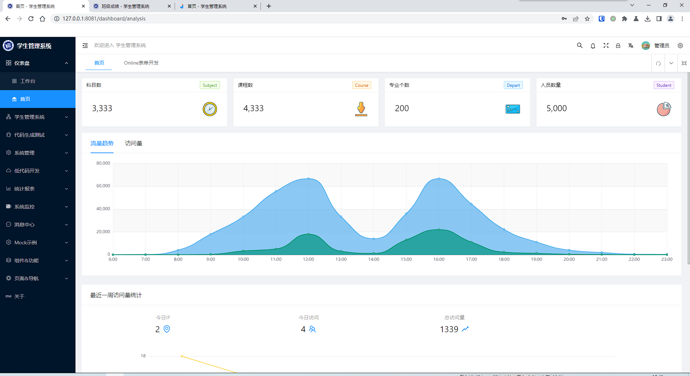
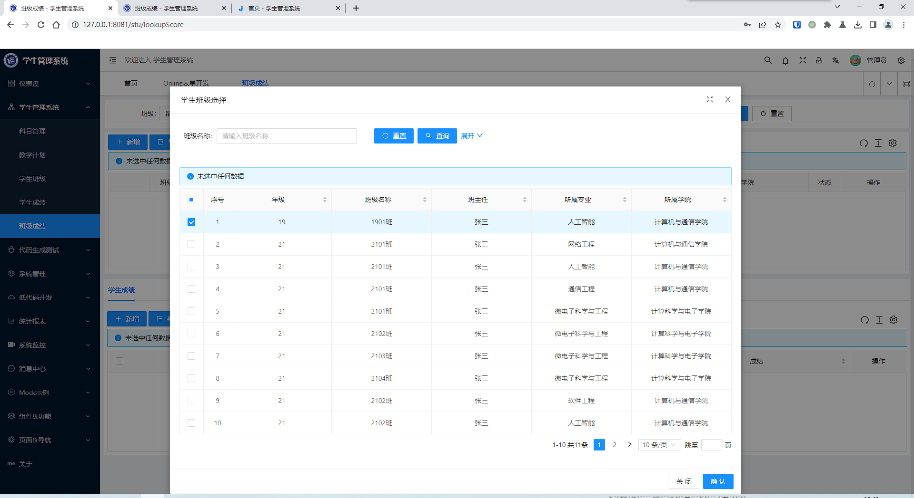
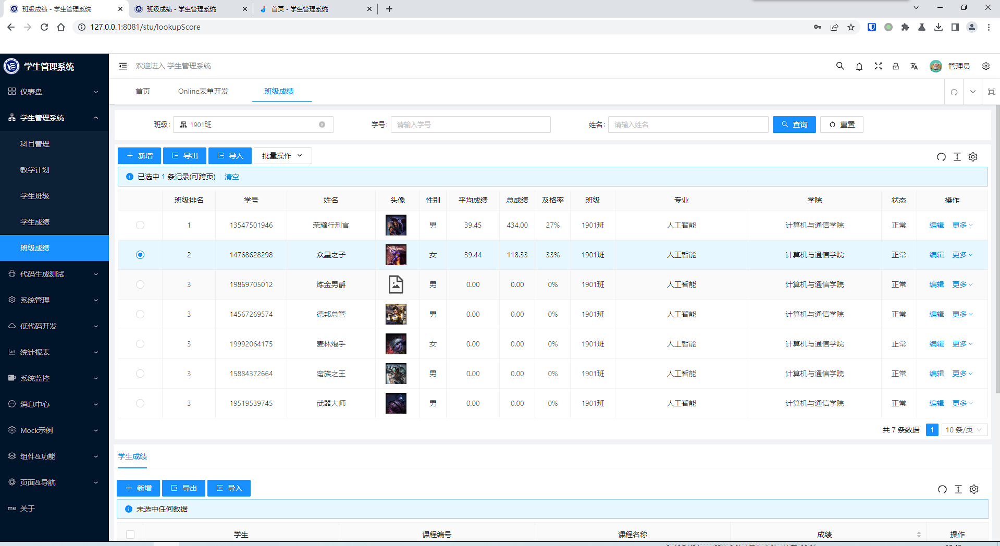
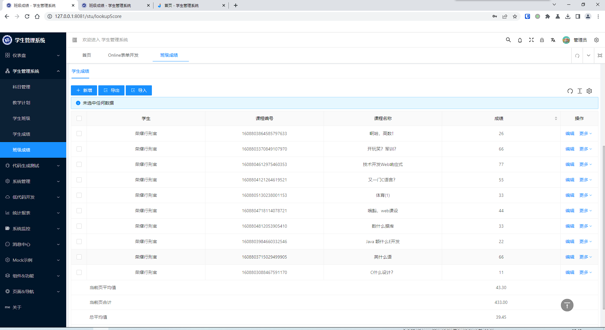
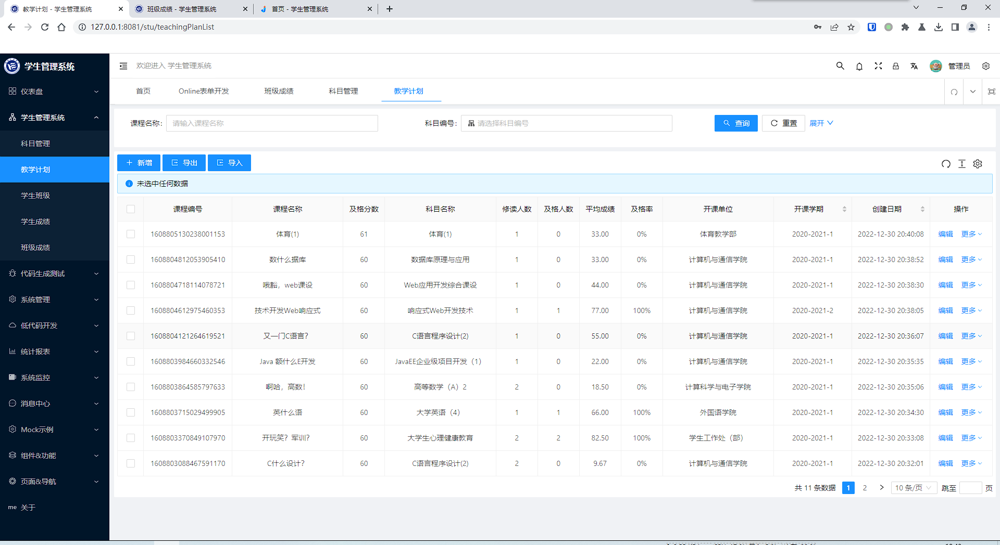
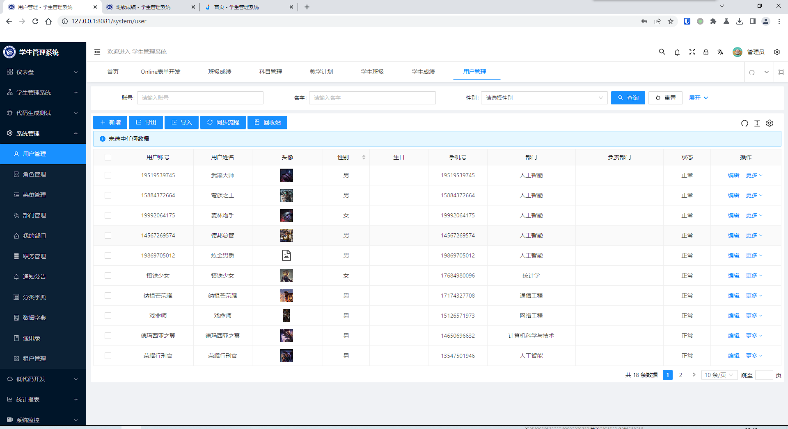

# java学生管理系统

基于JeecgBoot开发

后端: [java-student-management](https://github.com/james-curtis/java-student-management)

前端: [java-student-management-fontend](https://github.com/james-curtis/java-student-management-fontend)

数据库: [java-student-management-database](https://github.com/james-curtis/java-student-management-database)

# 截图

